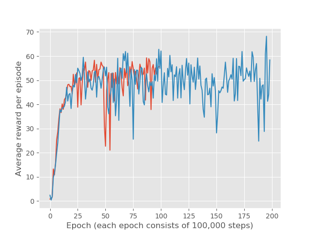

# DQN 

After debugging my DQN algorithms for roughly one month, I was able to get an average score of roughly 200 per episode for breakout (Breakout-v4 in openAI gym). But it is still much lower than the results shown in DeepMind's paper. The training stats is shown below

Note that due to clipping the reward of each step into [0,1], the actual score for each episode is higher than the reward shown in the figure, which is actually the summation of clipped reward for each step. 

A demo of playing the game with the trained agent.

## For training 

Run `train.py`. 

## For playing with a trained agent

Run `play.py`. The path to the trained model needs to be specified. 

## References 
- https://github.com/dennybritz/reinforcement-learning/issues/30
- https://github.com/futurecrew/DeepRL
